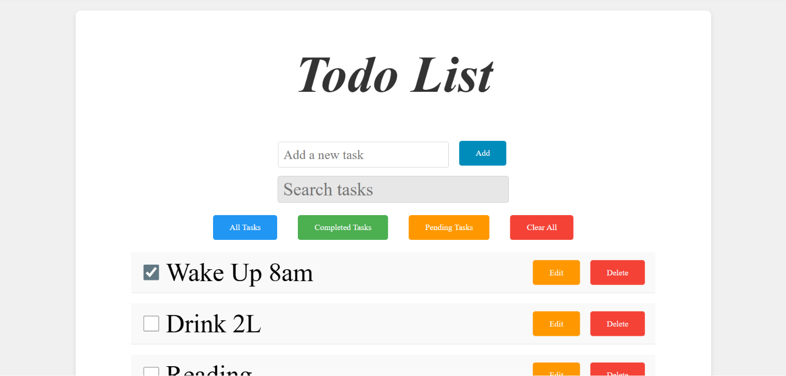
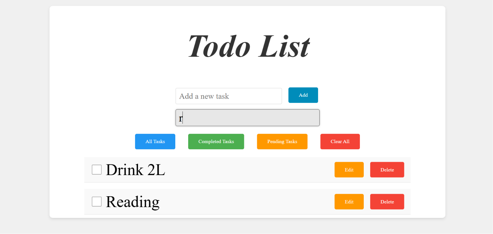

# 📝 Todo List App

A simple and responsive Todo List application built using **HTML, CSS, and JavaScript**.

This project allows users to add, edit, delete, search, filter, and save tasks using the browser's Local Storage.

---

## 🚀 Features

✅ Add new tasks  
✅ Edit existing tasks  
✅ Delete tasks  
✅ Mark tasks as completed  
✅ View all tasks  
✅ Filter completed tasks  
✅ Filter pending tasks  
✅ Search tasks  
✅ Clear all tasks  
✅ Save tasks using Local Storage  
✅ Responsive design for desktop, tablet, and mobile screens  

---

## 🛠️ Technologies Used

- HTML5
- CSS3
- JavaScript (ES6)
- Local Storage 

---

## 📸 Preview





---

## 📂 Project Structure
``` 
Todo-List/
│
├── index.html
├── style.css
├── script.js
└── README.md
```

---

## ▶️ How to Run

1. Clone the repository:

```bash
git clone https://github.com/your-username/todo-list.git

2.Open the project folder.
3.Open index.html in your browser.

No installation or dependencies required.

```

## 💡 How It Works

When a user adds a task, it is stored in an array of objects.
Tasks are saved in **Local Storage** so they remain after refreshing the page.
Users can update the status of tasks using the checkbox.
Search and filter options help manage tasks easily.

---
## 📱 Responsive Design

The application is designed to work on:

💻 Desktop
📱 Mobile
📟 Tablet

Using CSS media queries.

---
## 👨‍💻 Author

Created by **Zaynab Hwayji**

---
## 📄 License

This project is open source and available for educational purposes.

---
